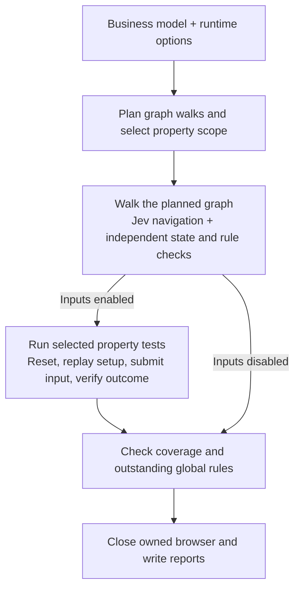

# testwalker

A Python CLI framework that tests websites and JSON-RPC APIs from a **GraphWalker business model**. A business analyst describes states, journeys, expected outcomes and input rules. For websites, the framework discovers controls at runtime using [Jev Ultrafast](https://github.com/browser-use/jev-ultrafast).

Web models contain **no UI selectors, page objects, browser action lists or assertion expressions**. The same runner handles the booking and enquiry demos without site-specific test code. API models add declarative request mappings and deterministic response predicates.

- **GraphWalker Rust** generates seeded paths through the graph.
- **Jev Ultrafast + Browser Harness** discover and operate observed browser controls.
- **TypeSafe Jev** independently identifies the current business state and judges its requirements.
- **Hegel** runs input testing, generating focused constraint cases by default and shrinking reproducible failures. Broader combinations are optional.

A target-independent **Rust core** calls native GraphWalker and [Hegel](https://github.com/hegeldev/hegel-rust), schedules execution, calculates verdicts and verified coverage, and calls Jev. A bidirectional JSON-RPC connection lets the Python web adapter perform browser operations and prepare web evidence. Hegel is the only property engine; there is no Python property engine or alternate backend. See [architecture](docs/architecture.md) and the [adapter protocol](docs/protocol.md).

**Start with the [plain-English testing guide](docs/testing.md)** for the workflow diagram, copyable commands, input counts, resets, Jev allowances and result meanings. The sections below provide installation and detailed reference information.

## Test JSON-RPC APIs

Testwalker can test its own API using two separate workers, with GraphWalker exploring sequences and Hegel generating input boundaries. This needs no browser or Jev key:

```bash
uv run testwalker self-test
uv run testwalker self-test --plan
uv run testwalker rpc --model models/my-api.json --target /path/to/api-server --target-arg=--stdio
```

Both commands support exploration, input tuning, lifecycle hooks, reports and individual case replay. The [RPC testing guide](docs/rpc-testing.md) explains declarative bindings, deterministic assertions and callbacks; [the bundled self-test model](models/rpc-selftest.json) provides a working example.

## Generate an initial model

Discovery needs Chrome but no Jev key or GraphWalker executable:

```bash
uv sync
uv run testwalker discover-sitemap --sitemap sitemap.xml --output models/discovered.json
uv run testwalker discover-url --url http://127.0.0.1:4173/ --depth 1 --headed --output models/explored.json
```

The explorer uses Crawlee’s Python `PlaywrightCrawler` for scheduling and browser management. Sitemap discovery only inspects listed pages. URL discovery follows same-origin links and submits forms one level deep by default. Use `--values` for field overrides and `--hooks` for custom widgets or setup calls. The output is a selector-free draft plus an inventory of observed forms, constraints, controls and unresolved items. Discovery also saves screenshots, rendered HTML/live DOM snapshots and endpoint traffic with JSON request/response bodies, linked to each visit. Accessibility checks remain the walker’s job. Business rules still need human review. See [discovery options, hooks and the Python API](docs/discovery.md).

## Use the framework

Author and export your model in GraphWalker independently, using its editor or MCP with your preferred assistant. Alternatively, [bootstrap a draft from a sitemap or URL](docs/discovery.md) without AI, then review it in GraphWalker. The package does not expose an authoring MCP. It consumes one exported GraphWalker JSON model with the [business specification](docs/model-format.md): state descriptions, journey intents, expected outcomes and input constraints. A bare navigation graph cannot supply missing business expectations.

Install the local package with Python 3.12+ and [uv](https://docs.astral.sh/uv/getting-started/installation/):

```bash
# From this repository:
uv tool install .
# Or build and install a wheel locally:
uv build --out-dir build
uv tool install ./build/testwalker-4.0.0-*.whl
testwalker --help
```

Building from this checkout or a source archive requires **Rust 1.88+ and Cargo**, Python 3.12+, and a working platform linker. The package build compiles the Rust worker and includes it in a platform wheel. Installing that wheel does not require Rust or a separate GraphWalker executable. Chrome remains required for web runs. Cargo pins native GraphWalker and Hegel revisions in `Cargo.lock`; Python dependencies, including Jev Ultrafast, are pinned in `uv.lock`.

For source development, run `uv sync` to install the editable package and build the core. The build also recognises this checkout's local `.tools/cargo` toolchain. To rebuild Rust directly, use `cargo build --release --locked`. Nothing is published by these commands.

Models, demo HTML, Trailhead hooks and a sample configuration ship inside the wheel. The installed `testwalker` CLI works from any directory. `python -m testwalker` is an equivalent entry point. No shell launcher is required.

For web runs, create `testwalker.properties` in your working directory, or copy [testwalker.properties.example](testwalker.properties.example) and edit it:

```properties
TYPESAFE_API_KEY=your_jev_key
```

Runtime settings come from this file; exported environment variables do not replace them. Relative paths resolve from the properties file's directory; quote paths containing spaces. This local file is ignored by Git. Use `--config /path/to/settings.properties` for another location.

| Property | Meaning |
| --- | --- |
| `TESTWALKER_CORE_BIN` | Optional override for the bundled Rust worker executable. GraphWalker is linked into this worker. |
| `GRAPHWALKER_BIN` | Accepted for legacy Python integrations; the CLI does not invoke it. |
| `TYPESAFE_API_KEY` | Required for live `run` and `demo`. Your Jev key. |
| `TYPESAFE_MODEL` | Optional decision model; default `jev-latest`. |
| `CDP_URL` | Optional existing Chrome debugging endpoint. When supplied it must already be running. |
| `CHROME_EXECUTABLE` | Optional Chrome executable path; otherwise the CLI locates Chrome. |
| `CHROME_PROFILE_DIR` | Optional isolated test profile; default `~/.cache/testwalker/chrome-PORT`. |
| `CHROME_DEBUG_PORT` | Optional local debugging port; default `9222`. |
| `TEXT_MODEL_API_KEY`, `TEXT_MODEL_BASE_URL`, `TEXT_MODEL` | Optional text helper for undeclared free-text journeys. Bundled demos do not need it. |

Inspect your model and run against your application:

```bash
testwalker validate --model /path/to/exported-model.json
testwalker plan --model /path/to/exported-model.json --config testwalker.properties
testwalker run \
  --model /path/to/exported-model.json \
  --url http://localhost:3000 \
  --config testwalker.properties \
  --generator quick_random --edge-coverage 100 --state-coverage 100 \
  --walks 2 --max-steps 300 \
  --max-calls 1000 --headed
```

The CLI starts Chrome with a dedicated profile and waits for its debugging endpoint. `--headed` opens visible Chrome and focuses new test tabs. A browser started by the CLI is stopped afterward, in both visible and headless modes, including failed or interrupted runs. Add `--headed --keep-browser-open` to explicitly retain the test tab and browser for debugging. An existing ready endpoint is reused and never terminated. `--cdp-url` overrides the configured endpoint. Credentials are not written to the graph or report. `validate` and `serve` do not need configuration; `plan` uses the native core, without a browser or API key.

The execution components are independent of model authoring:



Property campaigns run after the graph walk. Each input attempt starts in a fresh tab and replays a setup route to its form. Browser navigation and outcome checks run throughout both phases. Graph-only runs proceed directly to the final checks. The [testing guide](docs/testing.md#what-happens-during-a-run) shows the loops and responsibilities in more detail.

| Control | Meaning |
| --- | --- |
| `--generator NAME_OR_EXPRESSION` | Choose a native walk mode or complete generator expression, including chains. Without overrides, preserve the exported generator. |
| `--edge-coverage`, `--state-coverage` | Required verified percentages. The other target retains its model value. Named coverage modes use both targets as their stop condition; an explicit native expression keeps its own stop condition. |
| `--walks N` | Repeat graph traversal from the start with seeds `seed`, `seed+1`, etc. (1–100). Each walk must plan the targets. Verified coverage is the union. |
| `--max-steps N` | Maximum graph elements per walk, including state checkpoints. A route exceeding this budget is inconclusive before browser execution. |
| `--input-mode all` | Generated examples and explicit boundaries; opt-in broader exploration. |
| `--input-mode generated` | Hegel-generated examples only. |
| `--input-mode focused` | Default: Hegel generates within separately planned constraint partitions. |
| `--input-mode boundaries` | Exact boundary values, executed through Hegel. |
| `--input-strategies PATH` | JSON generation defaults and per-field overrides for focused mode. |
| `--strategy-provider PATH` | Trusted Python extension providing declarative custom Hegel domains. |
| `--input-mode none` | Graph journeys only; reports explicitly say input campaigns were disabled. Nominal data submission journeys still execute. |
| `--cases N` | Generated examples per phase (1–200, default 1). Focused mode has a phase per constraint partition; generated mode uses per-field and combined phases. Shrinking can add attempts. |
| `--max-input-attempts N` | Select up to N property inputs in model order before execution (default 1000). Shrinking and reproduction share this attempt limit. Passing the selected scope can produce PASS. |
| `--no-shrink` | Disable the shrinking phase. Hegel may still replay a failing example to confirm it. |
| `--max-calls N` | Hard cap on Jev requests across the whole run (default 1000). |
| `--max-actions N` | Maximum browser decision cycles per journey (default 25). |
| `--threshold N` | Required Jev confidence (default 0.85). |
| `--hooks hooks.py` | Explicitly load optional trusted Python lifecycle extensions. |

A small smoke run can use one walk and `--input-mode none`; deeper testing can add walks and `--input-mode all --cases 20`. Lower coverage targets change the selected scope, not the meaning of a failed business requirement. Global requirements must still be evidenced, so a short route can be inconclusive if it never exercises one. Runtime overrides never rewrite your input file; the report stores the effective model, targets and seeds.

For a small input sample, use `--input-mode generated --cases 1 --max-input-attempts 2 --no-shrink`. This selects the first two property phases in model order, with one generated example each. If those checks, the selected graph walk and required business rules pass, the run passes. Remaining property phases are outside the selected scope and do not count as skipped tests. This deterministic sample does not represent every campaign or field. With larger `--cases` values, the limit can select only part of a generation phase; its planned example count is reduced before execution.

Hooks can reset a backend, seed test data, call APIs, or make deterministic assertions around individual states and transitions. They are optional application code outside the graph. See [lifecycle hooks](docs/hooks.md) for events, ordering and failure behavior. Pure browser tests need no hooks; stateful applications often need a repeatable reset to make property testing meaningful.

## GraphWalker walk modes

All seven native modes are available through `--generator`, or through the generator already in the exported model. The framework passes expressions to the linked native GraphWalker library. See [GraphWalker’s generator reference](https://graphwalker.github.io/graphwalker-rs/generators.html).

| Mode | Usage and constraints |
| --- | --- |
| `quick_random` | Steers toward unvisited elements; default for this demo. |
| `random` | Uniform random exploration; may require many more steps. |
| `weighted_random` | Uses the exported graph’s edge weights. |
| `shortest_all_paths` | Requires an Eulerian or semi-Eulerian graph. The expanded booking graph is not compatible. |
| `new_york_street_sweeper` | Covers all edges in a strongly connected graph; takes no stop condition. Works with the expanded demo. |
| `predefined_path` | Requires the exported model’s `predefinedPathEdgeIds` sequence. |
| `a_star(...)` | Requires a target expression, such as `a_star(reached_vertex(visit))`. |

Native stop conditions and chained generators are accepted. For example:

```bash
# Full exploration, then return to the home state.
testwalker plan --generator 'quick_random(edge_coverage(100)) a_star(reached_vertex(home))'

# Inspect a targeted route instead of demanding full coverage.
testwalker plan --generator 'a_star(reached_vertex(visit))' \
  --edge-coverage 0 --state-coverage 0

# Efficient complete edge coverage for this demo.
testwalker demo --headed --generator new_york_street_sweeper --input-mode none
```

Coverage is an independent verification gate. A short A* or predefined route cannot claim full graph coverage; choose appropriate targets explicitly. During a live run, global business requirements must still be evidenced, even when the route is short. Native failures (such as a non-Eulerian graph) remain visible as inconclusive results. Guards, executable model actions and multiple linked models remain outside this framework’s business-model contract.

With seed 42, the expanded demo plans **149 elements with quick_random** and **143 with new_york_street_sweeper**, both covering 35 edges. Uniform random needed 2171 elements and weighted random needed 1503 in the same native check; raise `--max-steps` (for example to 3000) and the API-call budget for those modes. Other seeds can differ. Native planning counts are not evidence that browser tests passed.

## Run the demo

After installing the package and creating the properties file:

```bash
testwalker demo --headed
testwalker demo --site feedback --headed
testwalker demo --bug --headed
testwalker demo --seed 42 --input-mode generated --cases 3 --max-calls 1000 --headed
```

The demo starts its own local HTML server and opens a test tab in isolated Chrome. **A Jev key is required for browser testing; there is no local-only execution mode.** No OpenAI key is required. To work directly from this checkout, use `uv sync` once and prefix commands with `uv run`, for example `uv run testwalker demo --headed`.

The booking demo now has **Home, Workshops, Our studio and Visit** pages with a shared menu, plus the booking, review, rejection and confirmation states. The selector-free business model contains **8 states and 35 journeys**, including navigation away from each booking state, links between information pages, and booking from the catalogue. The enquiry demo remains a separate small fixture.

The booking demo's `--bug` switch deliberately permits five places although the model permits at most four. Its intended result is `FAIL` when Jev successfully navigates and verifies that case. The switch persists through the new menu links. Before the boundary-default change, a live run with `--generator new_york_street_sweeper --cases 1` passed all 35 journeys, all 8 states and 66 input attempts using 194 Jev calls at the default 0.85 confidence threshold. Both property campaigns completed and both global requirements were verified. This is one measured run; provider judgments and future runs can vary. Framework unit tests use mocked remote responses. Your key and an adequate call budget are required for live testing.

## Larger example: Trailhead

The [Trailhead example](examples/trailhead/README.md) adds **20 states, 148 journeys, three data sets and seven property campaigns**, including trip comparisons, equipment, policies, member profiles, bookings and full refunds. Its optional [hooks](examples/trailhead/hooks.py) reset a synthetic backend, verify inventory and refund transactions, and operate a bespoke departure-pickup list through its real widget events. Widget selectors remain outside the [business model](models/trailhead.json).

Start with its short predefined scenario in visible Chrome:

```bash
testwalker demo --site trailhead --demo-hooks --headed \
  --generator predefined_path --edge-coverage 0 --state-coverage 0 \
  --input-mode none --max-steps 1000 --max-calls 250
```

This visits 14 journeys and 14 states, including explicit invalid examples and both backend hook scenarios. For full coverage, use `--generator new_york_street_sweeper --edge-coverage 100 --state-coverage 100 --max-steps 1000 --max-calls 2500`; omit `--input-mode none` to use the default boundary campaigns, with a larger Jev allowance if needed. The example guide covers budgets, weighted exploration, targeted A*, chained routes, and injected inventory/refund defects.

For full graph coverage and the recommended focused boundary checks, from the source checkout:

```bash
uv run testwalker demo --site trailhead --demo-hooks --headed \
  --generator new_york_street_sweeper \
  --edge-coverage 100 --state-coverage 100 --max-steps 1000 \
  --max-calls 10000
```

This selects all seven campaigns and 186 focused Hegel phases, with one example per phase. Reproduction and shrinking can add attempts; no combined-field exploration runs by default. Increase `--cases` or configure per-field strategies without changing the model or runner; see [input strategies](docs/input-strategies.md). For broader exploration, explicitly add `--input-mode all --cases 20 --max-input-attempts 2000`; that offers up to 826 planned inputs. See the [boundary coverage table](docs/testing.md#default-focused-boundary-checks). For full graph exploration with just two generated inputs, see the [small-scope command](docs/testing.md#full-trailhead-graph-with-just-two-property-inputs).

## Chrome connections

The CLI's dedicated profile avoids reading the everyday Chrome profile's `DevToolsActivePort`. To choose another debug port or profile, set `CHROME_DEBUG_PORT` or `CHROME_PROFILE_DIR` in the properties file. Remove `CDP_URL` when you want the CLI to start Chrome automatically. When connecting to a browser you manage, supply `CDP_URL` or `--cdp-url`; the framework checks readiness and reports an unavailable endpoint instead of launching a replacement.

## What the analyst maintains

See [models/booking.json](models/booking.json) and [models/feedback.json](models/feedback.json). They are native GraphWalker JSON graphs with `properties.business` metadata.

A journey describes the business operation:

```json
{
  "intent": "Submit the supplied booking details for review. Stop after the first acceptance or rejection.",
  "data set": "Booking details",
  "rejected at": "needs_correction"
}
```

A business field declares its meaning and permitted values:

```json
{
  "Number of places": {
    "description": "How many people will attend the workshop",
    "type": "whole number",
    "required": true,
    "minimum": 1,
    "maximum": 4,
    "example": 2
  }
}
```

A state describes what it means and its requirements, such as “The total in AUD equals the submitted number of places multiplied by 45.” These are prose requirements, not executable expressions. Business field names need not match visible labels: “Number of places” maps to the demo's “Seats” field through Jev's observed choices.

The analyst maintains this business specification; the framework supplies traversal, browser interaction, generation and reporting. A bare graph without meaningful state descriptions and requirements cannot define correct application behavior. The runtime accepts exported JSON. See the [input model contract](docs/model-format.md).

To test a different site:

```bash
testwalker run --model my-model.json --url http://localhost:3000
```

Start your application separately. The model's `entry path` is relative to the supplied site's origin. No application-specific Python functions are registered.

## How a run works

1. Validate the model, generate GraphWalker's seeded route and select property phases. Save the plan before browser actions.
2. Follow the planned graph route. Jev chooses observed controls to carry out each edge's business intent.
3. Independently identify the destination state and check its rules. Credit an edge only after verification passes. States describe business situations and can share a URL.
4. After the graph walk, run the selected property phases. The model's data constraints determine whether each input should be accepted or rejected.
5. Before every input attempt, open a fresh tab and replay a shortest setup route to the form. Optional reset hooks restore backend fixtures. Setup and property attempts do not increase graph coverage.
6. Submit the exact input once and verify its outcome. Hegel can reproduce and shrink failures within the remaining allowance; an observed defect is retained if minimization reaches that limit.
7. Check requested graph coverage and outstanding global requirements, perform cleanup, and write reports. Stop at the first defect or unverifiable check.

See the [workflow diagram and input-count examples](docs/testing.md). A fresh tab does not clear cookies or backend state; stateful applications need appropriate [reset hooks](docs/hooks.md).

### Browser navigation and verification details

Every global requirement must be verified at an applicable checkpoint or in the final audit. Large audits share repeated rule text and use bounded requests. Validation evidence can be scoped through the model's data sets and accepted/rejected states; other rules use conservative relevance checks, retaining uncertain matches. A contradictory or unresolved applicable result prevents a pass.

The integration adapts Jev's `Browser`, `action_space`, choice validator and policy prompts rather than calling its public `Agent` unchanged. For data journeys, Jev maps business meanings to observed editable fields; Python supplies literal generated values, including blanks and invalid values. Before submission it verifies every value, allowing only whitespace trimming when the business dictionary permits it. It discovers and scrolls to fields outside the viewport. Field ordering is handled by the framework, and Jev identifies the submission control. The runner stops after the first submission so the agent cannot repair rejected input and hide a defect.

Generic accessibility observations distinguish alerts, validation messages and editable fields from ordinary page text. Jev classifies prose requirements internally so comparisons receive literal expected data while outcome checks receive relevant observed evidence. Unclear classification preserves the full comparison context; it never grants a pass. Navigation evidence includes rendered links and buttons outside the viewport, so the walker can scroll to them before clicking. If the next operation is uncertain, one focused request can select an observed navigation control, with the same confidence threshold; unresolved answers still stop the run. If several navigation controls appear equivalent, a bounded extra request checks their suitability individually. State and rule verdicts retain the configured confidence threshold. If a batched state-rule verdict is uncertain, the verifier isolates that same question once with the same observed evidence and threshold. Both answers are retained in the report. Known failures and provider refusals are not retried, and unresolved checks remain inconclusive. Last-submitted data is only a reference for explicit comparisons; empty or default-valued inputs can still establish that a form is available.

## Results and cost controls

| Result | Meaning | Exit code |
| --- | --- | --- |
| PASS | All checkpoints and property phases selected by the run configuration passed, and required verified coverage and business rules were established. | 0 |
| FAIL | An observed state or requirement contradicts the business model. | 1 |
| INCONCLUSIVE | Navigation, data entry, provider confidence, setup, a call/action limit or infrastructure prevented verification of selected work. | 2 |

Semantic navigation and judging remain probabilistic, even though graph generation and input constraints are formal. These checks measure modeled coverage and sampled data; they do not prove the website correct. A changing or inconsistent judgment can prevent reliable shrinking and produce `INCONCLUSIVE`.

The default confidence threshold is **0.85**, maximum model calls **1000**, and maximum decision cycles per journey **25**. Operation and speculative target questions share a request; rule checks and field bindings are batched. Exact requests are cached within a run. No provider retries silently exceed the call cap. Reports count calls, cache hits and any provider-reported token usage. A request cap is not a dollar budget; actual cost and full-run call volume need measurement with your key.

`--input-mode focused` is the default: Hegel generates within separately scheduled constraint partitions, varying one field while others remain valid. `--cases` defaults to **1 per partition** and can be raised without changing implementation. Singleton checks exhaust naturally. Per-field JSON settings and optional custom Hegel domain providers are described in [input strategies](docs/input-strategies.md). For broad per-field and combined generation, select `generated` or `all`. Use `--max-calls` to cap Jev requests; hitting it is inconclusive, not a partial pass.

`--max-input-attempts` determines the selected property scope before execution. A smaller value does not by itself make the result inconclusive. Reports show selected phase completion separately from completion of full campaigns, and retain the available phase and example counts. A provider error, uncertain outcome or failed setup within a selected test still prevents PASS. Global business requirements must still be verified even when the input scope is small.

Every started run saves `artifacts/<timestamp>/report.html`, `report.json` and the exact `model.json`. Reports include verified coverage, observed browser evidence, rule judgments, raw Jev decision requests/responses, action trace and usage. Property failures also save `replay.json`. Unresolved state requirements name the exact rule and retain its answer in the report. The test tab closes when execution ends unless `--headed --keep-browser-open` is supplied; the demo server stops when execution ends. Initial configuration/model errors can exit before a report is created. Viewport screenshots are saved locally after each executed graph check and property attempt. They are never sent to Jev; its decisions use visible text and structured controls. Use `--no-screenshots` to disable image capture. Artifacts are ignored by Git.

## Visual report and screenshots

Open the `report.html` path printed when the run finishes. It is a local viewer with embedded data and no external libraries or server requirement. Keep its `screenshots/` directory beside it when copying or uploading the report.

- Select a graph state or connection to filter its related tests. Toggle **All connections** for the complete graph; the selected journey is highlighted. Use **+ / −** to zoom and scroll the graph, or **Fit** to restore the overview. Graph colors summarize graph checks, while property outcomes remain separate.
- Search cases and filter by outcome or graph/property type. Select a case to see its intended behavior, exact inputs, observed checkpoints, rules, actions and Jev decisions.
- Each graph check captures its final viewport, including a failed or inconclusive stop when the tab remains available. Each executed property attempt captures separately, including reproduction and shrinking attempts. Use the **Input attempt** selector to inspect them. A failed generation phase defaults to its last failing input, even if later shrinking attempts passed; other phases default to their final attempt. A note identifies when the input allowance limited failure reproduction or shrinking.
- Click an image to open it at full size. Skipped cases and unselected inputs have no screenshot. Capture failures are shown without changing the test verdict. A screenshot reflects the page after the check and its hooks, rather than an atomic copy of the earlier semantic observation.

Detailed Jev transcripts are stored under `evidence/` and loaded only when you expand a case’s **Actions & Jev decisions**. Keep that folder beside the HTML report when sharing or moving it. Full raw evidence remains in `report.json`; failed/skipped JUnit triage evidence is retained.

PNG images are stored under `screenshots/` and referenced in JSON and JUnit evidence. Capture adds browser/disk work but no Jev requests. `--no-screenshots` disables capture while retaining the graph and results viewer. Existing historical reports do not acquire screenshots retroactively; the new viewer and images are produced by subsequent runs.

The selected seeded graph paths, nominal graph inputs and explicit boundary inputs are computed before browser actions. Hegel phases are planned beforehand, but their actual generated inputs and shrinking are determined during execution. Successful duplicate inputs within a phase are not resubmitted.

## JUnit and planned test inventory

Every started run automatically produces `junit.xml` beside `report.html` and `report.json`; the CLI prints its path. CI can collect `ci-results/**/junit.xml` when the run uses `--output ci-results`. Keep the neighboring HTML, JSON, model, inventory and any replay artifact with the XML for investigation.

Before run hooks or browser actions, Testwalker generates **all selected seeded graph walks** and saves `plan.json`. This immutable inventory lists the selected tests; `report.json` records their final outcomes. Planning does not call Jev. If native planning fails, the report identifies the failing walk and marks the available inventory incomplete; it cannot invent a route for a walk GraphWalker could not generate.

| Planned test | How its count is determined |
| --- | --- |
| Graph starting state | One verification per selected walk. |
| Graph journey | One test per edge occurrence, including verification of its destination. Repeated visits have distinct test identities. Navigation alone cannot pass a test. |
| Explicit boundary input | Exact input and expected validity are known before execution. Each is a separate test. |
| Hegel generation phase | One test per selected field phase or combined-input phase. `--cases` supplies the requested maximum examples; input-scope selection may reduce that maximum. Actual attempts, failure reproduction and shrinking are recorded inside the phase. Finite domains can finish with fewer examples. |
| Overall run outcome | One additional JUnit test accounts for coverage, global requirements, planning, hooks and cleanup. |

JUnit maps a business defect to `<failure>`, an attempted but inconclusive check to `<error>`, and selected tests never reached to `<skipped>`. A partially executed generation phase whose outcome cannot be verified is an error; later selected phases or boundary cases are skipped. Work excluded by `--max-input-attempts` is outside the inventory, rather than skipped. No fictitious skipped generated examples are added. The overall run outcome also fails or errors when the run cannot pass, so an aborted run cannot look successful merely because its remaining selected tests were skipped. A defect can therefore appear on both its individual test and the overall result.

Failure/error entries contain the business intent, source/destination or property constraints, exact attempted inputs, observed checkpoints, rule verdicts, relevant browser actions and Jev requests/responses, hook errors, stop context and artifact references. Skips identify their planned test, the stop reason and the upstream failing test where applicable. The saved seed, effective generator, model hash and run limits support reproduction. `--debug` includes the stopping traceback. XML safely escapes browser text and generated values.

Only selected scope is counted. Graph edges omitted by the chosen route appear in `planning.unselected_edges`; input phases excluded by the attempt limit appear in `planning.unselected_properties`. The report's `scope.property_selection` records selected and available phase/example counts, and JUnit suite properties include these counts. A shortened generation phase retains its original `requested_max_examples` alongside its selected `max_examples`. Property modes disabled by `--input-mode none` are not reported as skipped failures. Replay runs contain the requested input test and overall outcome, without pretending to explore the graph. Configuration/model errors before a run is created still use the CLI error and exit code rather than producing a test inventory.

## Debugging an early exit

The runner stops at the first defect or unresolved outcome. Full graph coverage is a target, not permission to continue from an unverified state. Property campaigns run after graph traversal, so an early graph failure can have zero input attempts.

First separate native graph planning from browser execution; planning makes no Jev calls:

```bash
testwalker validate --model models/trailhead.json
testwalker plan --site trailhead --generator new_york_street_sweeper --max-steps 1000
```

Then isolate the short, predefined Trailhead scenario, retain the test browser, and include tracebacks:

```bash
testwalker demo --site trailhead --demo-hooks --headed --keep-browser-open --debug \
  --generator predefined_path --edge-coverage 0 --state-coverage 0 \
  --input-mode none --max-steps 1000 --max-calls 250
```

From a source checkout, prefix each command with `uv run`. Open the `Report:` path printed at exit. **Where execution stopped** identifies the phase, walk and model element; **Journey checkpoints** contains expected states, observed text and individual rule answers. **Full execution evidence** includes action traces, decision requests/responses and hook events. `--debug` adds the exception traceback to the console and report. It also prints configuration/import tracebacks for errors before a report can be created.

For low-confidence state identification, compare the expected description with the actual page and the last Jev answers. For unresolved requirements, determine whether the page really exposes the evidence; backend-only facts may need a lifecycle hook. For navigation failure, inspect the chosen controls and action trace. Increase `--max-calls` or `--max-actions` only when the corresponding limit is the stated reason for stopping. A two-attempt property limit selects a small input scope; it does not by itself produce INCONCLUSIVE or explain stopping after only a few graph edges.

The retained demo tab can be inspected, but its temporary server has stopped. For interactive reloads, run `testwalker serve --port 4173` in a separate terminal and test it using `testwalker run --model models/trailhead.json --url http://127.0.0.1:4173 --hooks examples/trailhead/hooks.py`, adding your exploration/debug options. Use the saved `model.json` from a report to reproduce its exact specification, and use the same `--seed` and generator for its route. Jev decisions can still vary between runs. Lowering the confidence threshold changes the acceptance standard; it is not a fix for an ambiguous model.

Replay one property counterexample:

```bash
testwalker demo --bug \
  --model artifacts/RUN/model.json --replay artifacts/RUN/replay.json

testwalker run --model artifacts/RUN/model.json \
  --url http://localhost:3000 --replay artifacts/RUN/replay.json
```

Replay requires the exact model hash and the same application setup. It checks one input and does not claim full coverage.

## Development and limits

```bash
uv run pytest
uv run ruff check testwalker tests
testwalker plan
testwalker plan --model models/feedback.json
testwalker serve
```

`plan` validates and prints an actual GraphWalker traversal without starting a browser or calling an API. It is a planning command, not an offline browser test. Python tests cover contracts, Jev choices, literal input entry, confidence and budgets, Hegel shrinking, coverage and replay. Native core tests exercise GraphWalker, Hegel, JSON-RPC and generic target adapters directly. Optional legacy CLI integration tests still use `GRAPHWALKER_BIN`. Build the local wheel and source archive with `uv build --out-dir build`; no publishing step is needed.

The framework currently handles one graph, ordinary visible HTML controls and bounded data dictionaries. It rejects native action scripts, guards, browser targets and assertion DSLs. Cross-field constraints and arbitrary generator programs are outside this vocabulary; relational outcome requirements can be written as prose, but are not translated into constraint solvers. Rejection must be modeled as a distinguishable business state.

Jev's upstream limitations apply: shadow roots, frames, canvas, file uploads, pop-up tabs, nested scrolling and custom keyboard widgets are outside its MVP. If a control cannot accept an exact generated value (for example an unavailable dropdown choice), that attempt is inconclusive. Opening a new owned tab does not clear the existing Chrome profile, cookies or server data; use a test environment whose start state can be revisited. Account provisioning and backend resets are not inferred from prose; supply optional lifecycle hooks when needed.
