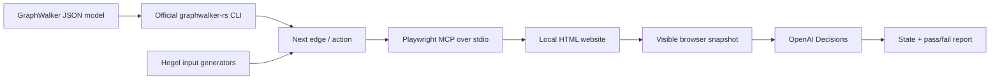

# model-test

A small JavaScript demo that uses a GraphWalker model to test **Fieldnotes**, a plain HTML workshop booking site. GraphWalker chooses the journey, Hegel supplies form inputs, Playwright MCP operates Chrome, and OpenAI Decisions checks the visible result.

This is a new local Git repository. Nothing is deployed or published.

## Run it

Install **Node.js 22+**, **Git**, and **Google Chrome** first. Setup uses **Rust 1.88+** when available, or bootstraps a local Rust toolchain under `.tools/` automatically. Then, from this directory:

```sh
npm install
npm run setup
npm run demo:offline
```

Setup builds the official [graphwalker-rs](https://github.com/GraphWalker/graphwalker-rs) source at the commit pinned in [graphwalker.lock.json](graphwalker.lock.json). The first setup downloads the source and any required local toolchain, then compiles the CLI. It does not change shell profiles. See the [official getting-started guide](https://graphwalker.github.io/graphwalker-rs/getting-started.html).

The offline demo runs GraphWalker, Hegel, and a real Chrome browser through Playwright MCP. It uses explicit local assertions and makes **no OpenAI API calls**.

To run with the Decisions API:

```sh
cp .env.example .env
# Edit .env and set OPENAI_API_KEY.
npm run demo
```

The default model is `gpt-6-luna`. The live run requires an API key with access to the Decisions endpoint; it does not silently fall back to offline checks. **The live API has not been exercised here because no API key was provided.** Its request/response contract and failure handling have automated tests using mocked responses.

Other useful commands:

```sh
npm start                              # Browse the site manually; prints its local URL.
npm test                               # Unit and contract checks.
npm run demo:offline -- --headed        # Watch Chrome execute the tests.
npm run demo:bug                        # Deliberate defect: expect a nonzero exit.
npm run demo -- --seed 42 --cases 12
npm run demo -- --model models/booking.json
```

If Chrome is installed somewhere unusual, set `PLAYWRIGHT_EXECUTABLE_PATH` to its executable. `npm run demo` loads `.env`; for the offline scripts, export that variable in your shell if needed.

## How the pieces fit



| Component | Responsibility |
| --- | --- |
| [models/booking.json](models/booking.json) | Input model: home, form, validation error, review, and confirmation, connected by named actions. |
| Official graphwalker-rs CLI | The actual Rust traversal engine, built from pinned upstream source. Reads the graph and produces the actions to execute. |
| [Hegel](https://hegel.dev/) (`@hegeldev/hegel`) | Generates valid and invalid form cases, including boundary values, and reduces failing inputs. |
| [Playwright MCP](https://github.com/microsoft/playwright-mcp) | A real MCP server launched over stdio. The runner calls its navigation, typing, clicking, snapshot, and screenshot tools. |
| [src/decisions.mjs](src/decisions.mjs) | Calls `POST https://api.openai.com/v1/decisions` with `gpt-6-luna`, using a `state` choice question and a separate `passed` predicate. |
| [dist/](dist/) | The website: HTML, CSS, and vanilla JavaScript, with no external assets or backend. |

The Decisions classifier identifies the observed state independently of the intended destination. A check passes only when the state matches the model and both state confidence and assertion probability are at least **0.85**. Unknown states, refusals, malformed responses, API failures, and low confidence cannot become passes. See the [official Decisions guide](https://developers.openai.com/api/docs/guides/decisions) and [API schema](https://developers.openai.com/api/reference/resources/decisions/methods/create).

The JSON model is the starting specification. `--seed 42` seeds both GraphWalker traversal and Hegel’s generated inputs, making them repeatable with the same model and dependency versions. `--model path/to/model.json` accepts a compatible GraphWalker model. Its state IDs and edge names must match this demo’s bindings; an arbitrary new website also needs new action bindings and state descriptions.

## What it tests

The main journey books a printmaking workshop, checks validation, reviews the submitted values and price, edits details, confirms, and starts again. Form rules are a trimmed name of 2–60 characters, a valid email address, and an integer seat count from 1 to 4 at $45 per person. Hegel explores boundaries and combinations beyond the graph’s example inputs.

`npm run demo:bug` serves the site with `?bug=seats`, which deliberately accepts **five seats** while still advertising a maximum of four. The expected result is a failure and a nonzero process exit. Remove `--bug` to use the correct behavior. `--cases 12` sets the mixed-input property’s case budget. A separate seat-only property has a 16-case budget, followed by four guaranteed seat boundaries; failure reduction can add more attempts.

## Inspect a run

Each run writes into `artifacts/<timestamp>/`:

- `report.html` — readable results and links to evidence.
- `report.json` — structured traversal, generated cases, and verdicts.
- Screenshots and the MCP transcript — what the browser showed and which tools were called.

The terminal prints the report location. Keep the report and seed when investigating a failure; the recorded traversal is the source of truth for the executed journey.

Live mode sends the current local browser evidence and synthetic test data to OpenAI. The API key remains in the Node process and is never placed in the page. Use test data only. The website does not charge money, send email, or save bookings.
