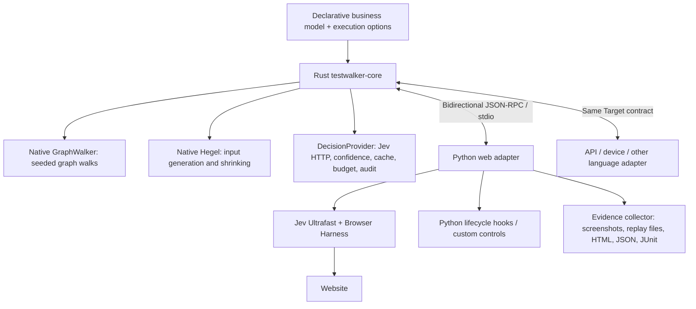

# Testwalker architecture

Testwalker separates the test framework from its execution target. A Rust library and JSON-RPC worker own graph planning, property generation, lifecycle, verdict policy, budgets, coverage and replay. The Python package supplies web and JSON-RPC target adapters and a shared CLI.

## Execution ownership

1. The CLI validates configuration, loads the exported model and starts the native worker.
2. Rust calls GraphWalker to calculate complete seeded routes and plans property phases before executing a target. Generated values are chosen later by Hegel.
3. Rust asks the adapter to initialize and reset the target, fires lifecycle hooks, and issues the model's next journey intent and literal inputs.
4. The web adapter asks Jev how to operate observed controls through core decision calls. Browser Harness performs the operations. The adapter returns observations and prepares web-specific state/rule questions.
5. The core applies the verification policy to observed state and rule decisions. Planned visits do not count as verified coverage.
6. After graph execution, Hegel produces inputs for the selected campaigns. Rust restores each case's source state through reset and modeled setup, submits once, and verifies acceptance/rejection. Stable failures are minimized; infrastructure and confidence uncertainty are latched.
7. Rust emits case events and a final report. Python captures web evidence and renders existing reports. Cleanup runs on pass, failure, uncertainty and interruption.

GraphWalker chooses graph edges; Jev chooses target operations and assesses observations. A grouped walk shares state. Property cases default to independent setup. Targets that can guarantee an isolated fixture snapshot may advertise checkpoint/restore to avoid repeated setup; the web adapter uses fresh tabs and reset hooks instead.

## Boundaries and modules

| Module | Responsibility |
| --- | --- |
| `crates/testwalker-core/src/model.rs` | Native model validation, business input validity and modeled setup paths. |
| `graph.rs` | Calls GraphWalker libraries and validates connected routes. |
| `properties.rs` | Hegel domain planning, generation, partition filtering and shrinking. |
| `engine.rs` | Schedules graph/property checks, hooks, isolation, coverage and replay. |
| `decision.rs` | Provider trait, Jev requests, confidence, caching, budgets and audit. |
| `protocol.rs` | Bidirectional JSON-RPC worker and cooperative cancellation. |
| `testwalker/core.py` | Python transport/client and native decision proxy. |
| `web_adapter.py`, `jev.py` | Browser operations, web evidence and web-specific decision questions. |
| `rpc_adapter.py`, `rpc_contract.py`, `rpc_transport.py` | Declarative API requests, deterministic assertions and a separate subject process. |
| `collector.py`, `report.py` | Capture and render results; they do not schedule tests. |
| `discovery/` | Independent Crawlee exploration and draft model generation. |

The Rust `Target` trait and JSON-RPC contract accept observations as JSON. They do not require a DOM, browser, URL or screenshot. With the default core evaluator, the core prepares state and business-rule questions directly over those observations. The web adapter opts into the adapter evaluator for its existing detailed web semantics; its calls still go through the native provider, and Rust determines the final verdict.

The JSON-RPC adapter also uses the adapter evaluator, with exact predicates over requests and responses instead of a decision service. `testwalker self-test` uses this adapter to test another native worker. Both targets share execution, hooks, reports and replay. See [RPC testing](rpc-testing.md).

`DecisionProvider` is the extension point for more decision services. The current worker ships Jev only. Other providers can be added in Rust without changing target adapters. This version has one synchronous run per worker and stdio transport; it does not provide a background RPC server or concurrent run scheduler.

## Replay and packaging

Every planned graph test and executed input has a replay recipe with model hash, journey, input and seed. Replaying a case starts from modeled setup; graph replay verifies the selected modeled destination, while input replay calculates acceptance/rejection from concrete data. This makes triage independent of the full preceding walk.

Python wheels bundle the compiled native worker. Source builds need Rust and a working platform linker; wheel users do not need separate GraphWalker or Hegel installations. Cargo and Python dependencies are pinned. Hegel is the sole property engine; old Python strategy extensions must return the new declarative domains described in [input strategies](input-strategies.md).
