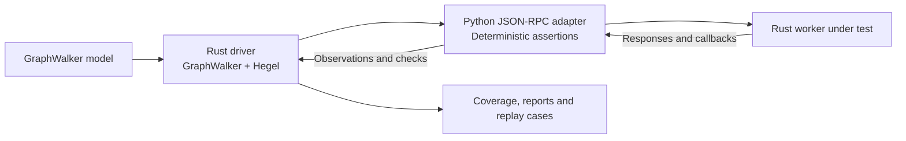

# Test JSON-RPC APIs

Testwalker can test its own API, or another executable that speaks JSON-RPC over stdin/stdout. GraphWalker chooses request sequences, Hegel generates inputs, and a deterministic adapter checks the responses. These runs do not open a browser or call Jev, and need no API key.

## Run the self-test

From an installed source checkout:

```bash
uv run testwalker self-test
```

The bundled [model](../models/rpc-selftest.json) exercises validation, planning, execution, saved results, replay, cancellation, shutdown, invalid requests and input boundaries. It configures synthetic decision settings and checks supplied decision answers without making provider requests.

Two separate native worker processes are used. One drives the test graph; the other receives the modeled API requests:



The driver compares the independently observed state with the model's expected state and owns the final verdict. The subject's execution scenarios use a small declarative target fixture; the fixture changes its state when operated rather than copying the subject's requested outcome.

Useful variations:

```bash
# Inspect the selected inventory without starting the subject.
uv run testwalker self-test --plan

# Explore the graph with only two selected property inputs.
uv run testwalker self-test --max-input-attempts 2 --no-shrink

# Broader generated input coverage with repeated graph walks.
uv run testwalker self-test --walks 3 --input-mode all --cases 10

# Keep these reports in a separate directory.
uv run testwalker self-test --output artifacts/self-test
```

`self-test` defaults to the bundled model and the same native executable as the driver. Use `--model` or `--target` to override either. `--core /path/testwalker-core` selects the driver. Alternatively, `--config settings.properties` reads its optional `TESTWALKER_CORE_BIN`; this command does not require a Jev key.

## Test another executable

```bash
uv run testwalker rpc \
  --model models/my-api.json \
  --target /absolute/path/api-server \
  --target-arg=--stdio \
  --timeout 30 \
  --output artifacts/my-api
```

Arguments are passed directly to the executable, without a shell. Repeat `--target-arg` for each argument; use `--target-arg=--flag` when the argument begins with a dash. For a Python service, select its interpreter with `--target`, then pass the script path with `--target-arg`. `--cwd` sets the subject's working directory.

The transport is **JSON-RPC 2.0 with one JSON object per line**, encoded as UTF-8. The target writes protocol messages to stdout and diagnostics to stderr. The adapter supports bidirectional requests, responses and incoming notifications; batch requests and HTTP/WebSocket transports are outside this profile. Each modeled journey normally sends a request and waits for a response. Notifications that deliberately have no response are covered by separate protocol tests rather than modeled request journeys.

`--timeout` bounds each request, including any nested callback exchanges. The framework owns the launched subject and closes it after execution. A reset starts a fresh process, restores initial variables, and sends the declared reset request. Graph journeys share that process until another reset or an explicit restart. Each property input resets and replays its setup route before sending the input.

## Bind a business model to requests

Keep the existing version 3 `properties.business` vocabulary for states, journeys and input constraints. Add a `properties.rpc` object to the graph and every state and edge. The [self-test model](../models/rpc-selftest.json) is a complete example.

At graph level, declare profile version 1, an initial request and deterministic checks for every global business rule:

```json
{
  "version": 1,
  "reset": {"method": "service.info", "params": {}},
  "fixtures": {"reservation": {"places": 2}},
  "variables": {},
  "rules": {
    "Responses identify the protocol version.": [
      {"path": "/response/jsonrpc", "equals": "2.0"}
    ]
  }
}
```

The same rule text must appear in `properties.business.rules`. Each business rule must have an explicit predicate binding; missing and extra bindings are rejected before execution.

A state's RPC object identifies it from evidence and checks its rules:

```json
{
  "match": [
    {"path": "/response/result/status", "equals": "confirmed"}
  ],
  "rules": {
    "The reservation has an identifier.": [
      {"path": "/response/result/id", "type": "string"},
      {"path": "/response/result/id", "length": {"min": 1}}
    ]
  }
}
```

All states' `match` predicates are checked independently. Exactly one state must match. No match or multiple matches is inconclusive, with predicate evidence in the report; the adapter never resolves ambiguity by assuming the intended destination.

An edge's RPC object maps its business input to a request:

```json
{
  "request": {
    "method": "reservation.create",
    "params": {"places": {"$ref": "/input/Places"}}
  },
  "capture": {"reservation_id": "/response/result/id"}
}
```

The edge's existing `data set`, `accepted at` and `rejected at` business fields determine which generated inputs should be accepted or rejected. The adapter passes the generated JSON values unchanged; it does not coerce invalid data into valid request parameters. Captured values are available to subsequent requests until reset.

For malformed-protocol tests, replace `method`/`params` with `"raw": "not json"` or `"envelope": {...}`. Raw text must fit on one line. These forms let the model assert on the returned protocol error. Optional request metadata `"restart": true` starts a fresh subject before sending; `"wait_for_exit": true` requires it to terminate after replying, useful for shutdown tests. Metadata is not sent as API parameters.

## References and predicates

References use exact [JSON Pointers](https://www.rfc-editor.org/rfc/rfc6901). `{"$ref":"/input/Places"}` copies a typed value. References can appear inside request parameters and expected assertion values, using `input`, `fixtures`, `variables`, `request`, `response`, or `callback` as the first path component. Strings are always literal: there is no interpolation, expression evaluator or executable model code. A missing reference is an error, not an implicit null.

Each predicate has a `path` plus one operation. A list of predicates is an AND condition.

| Operation | Meaning |
| --- | --- |
| `equals`, `not_equals` | JSON value comparison; booleans are distinct from numbers. |
| `type` | One of `null`, `boolean`, `number`, `integer`, `string`, `array`, `object`. |
| `exists` | Whether the pointer resolves; an explicit null value still exists. |
| `length` | String length, array size or object key count: `{"min":1,"max":10}` or `{"exact":2}`. |
| `contains` | String substring, object key, or exact array member. |
| `subset` | Recursive object subset; expected array members must occur in the actual array. |

Missing actual values fail all operations except `exists: false`. Checks retain the pointer, operation, actual value, expected value and pass/fail result. Observations also expose `callback_methods` and `process` (`running`, `exit_code`) for lifecycle assertions.

Python validates the complete RPC binding profile. The target-independent Rust core validates the metadata boundary and version, preserves it in callbacks and model fingerprints, and leaves transport-specific binding semantics to the adapter. Adding RPC metadata does not enable selectors, arbitrary business fields, model actions or guard scripts.

## Callbacks and lifecycle hooks

For APIs that send requests back to their caller, declare graph-level `callbacks`. An edge can override handlers for that journey. Each handler requires `result` and can update variables with `set`, issue a nested `request`, or `capture` values from the callback context:

```json
{
  "callbacks": {
    "target.execute": {
      "set": {"fixture_state": "done"},
      "result": {}
    },
    "target.observe": {
      "result": {"stage": {"$ref": "/variables/fixture_state"}}
    }
  }
}
```

`/callback/method` and `/callback/params` describe the incoming request. A nested request's complete response is available at `/callback/response`. Callback handling applies `set`, runs the nested request, captures values, then resolves the result. These are declarative fixture operations, not Python embedded in the model.

Use `--hooks hooks.py` for trusted custom setup or checks. The existing before/after run, walk, reset, state, transition and case events work here too. RPC hooks receive `ctx.target` (the adapter), along with `ctx.data`, `ctx.result`, `ctx.error` and `ctx.check(...)`; `ctx.browser` is unused. See the [hook lifecycle](hooks.md). Extra API calls belong in a hook only when they are deliberate fixture setup or independent checks; normal tested journeys should stay in the graph.

## Results, tuning and replay

Both commands accept the shared exploration options (`--generator`, `--edge-coverage`, `--state-coverage`, `--seed`, `--walks`, `--max-steps`) and Hegel options (`--input-mode`, `--cases`, `--max-input-attempts`, `--no-shrink`, `--input-strategies`, `--strategy-provider`). Defaults are one walk, seed 42, at most 1000 graph elements, focused input testing, one example per phase and at most 1000 property attempts. See [input strategies](input-strategies.md) to tune generation.

Each output directory contains the effective model, planned inventory, JSON report, JUnit XML, HTML viewer, protocol evidence and individual replay recipes. Requests, responses, callbacks, bounded stderr and predicate diagnostics replace browser screenshots. Replay a saved case with the same command and target configuration:

```bash
uv run testwalker self-test \
  --replay artifacts/self-test/RUN/replays/CASE.json \
  --output artifacts/replay
```

For custom APIs, repeat `rpc --model ... --target ...` and add `--replay`. Replay checks the model fingerprint and executes the saved case with its setup route. Do not combine replay with exploration or input-strategy overrides.

A wrong identified state, broken deterministic requirement or malformed target response is a failure. Unknown state, unavailable target or timeout can be inconclusive. Remaining selected cases are skipped with the stopping reason. Exit codes are `0` for PASS, `1` for FAIL and `2` for INCONCLUSIVE.

Self-testing adds useful sequence and boundary coverage, but cannot establish correctness by itself: driver and subject share implementation code and could share a defect. Keep the separate unit, protocol and adapter tests as independent checks. In particular, direct protocol tests cover notifications and malformed transport details that do not fit a request/response graph journey.
