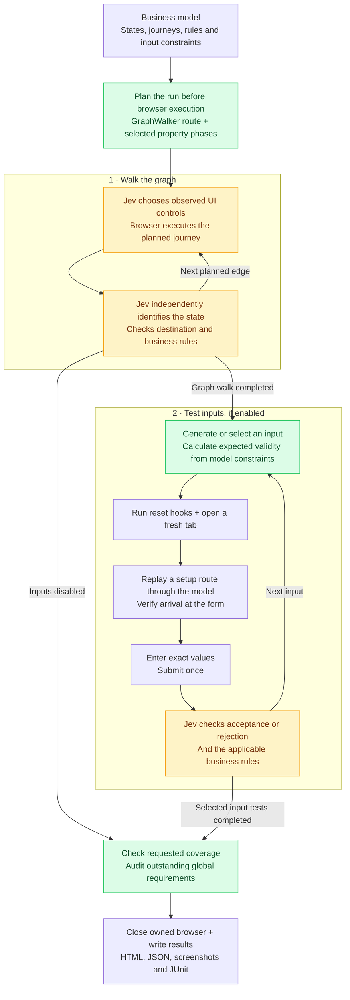

# Understanding and running Testwalker

Testwalker tests a website against a business model exported from GraphWalker. The model describes where a user can be, what they can do, what must be true, and which inputs are permitted.

A run has two parts: **walk the graph**, then **test inputs**. GraphWalker plans the navigation route; Jev helps operate and assess the website; Testwalker plans focused constraint checks by default and Hypothesis generates their inputs.

## Who does what?

| Component | Responsibility |
| --- | --- |
| Business model | Defines states, journeys, business rules, input constraints, and accepted/rejected outcomes. |
| GraphWalker | Plans an ordered graph walk using the generator, seed and coverage targets. |
| Jev | Chooses observed controls to fulfil a journey's intent, identifies the current business state, and checks requirements. |
| Browser Harness | Executes browser operations chosen by the navigator. |
| Hypothesis | Runs input tests, generates values within selected strategies, and tries to simplify inputs that expose a failure. |
| Testwalker | Selects test scope and boundary inputs, coordinates execution, calculates expected input validity, resets and replays setup routes, and writes reports. |
| Optional lifecycle hooks | Reset backend fixtures, make deterministic assertions, or operate a custom control that needs application-specific code. |

The Python implementation uses Hypothesis directly. It does not run the Hegel wrapper. Model authoring happens independently in GraphWalker; see the [model format](model-format.md).

## What happens during a run?



The diagram shows successful execution. The runner stops when it finds a defect or cannot verify a selected check, then performs cleanup and writes the available results.

1. **Plan first.** Save the selected graph walks and property phases to `plan.json`. Actual Hypothesis-generated values are chosen during execution; nominal graph inputs and explicit boundary inputs are known beforehand.
2. **Execute the graph walk.** Verify the start state, then follow GraphWalker's planned edges. Jev decides how to carry out each journey in the browser. It does not choose the next graph edge.
3. **Verify each destination.** Independently ask Jev which business state is visible, without supplying the expected answer. Compare that state with the expected destination, then check the requirements. Credit an edge only when its destination and checks pass.
4. **Run selected property phases after the graph walk.** Before every input attempt, reset and replay a setup route to its form. Setup routes are calculated by Testwalker from the model's ordinary journeys.
5. **Check the whole run.** Confirm the requested graph coverage and verify every global business rule, including any deferred to the final audit. Close browser resources owned by the CLI and save the report.

A business state is more specific than a URL. An untouched form, that form displaying validation errors, and a review awaiting confirmation can be different states on the same page. Visiting every edge also does not test every possible sequence of edges.

## How input testing works

Data submission journeys reference a data set and declare the accepted and rejected states. The data set specifies field types, ranges, lengths, allowed choices and valid examples. Journeys with the same source state, data set and outcomes share a campaign; submissions from a different source state get a separate campaign.

For each selected input, Testwalker calculates expected validity from the model's constraints. Valid data should reach the accepted state. Invalid data should reach the rejected state and show an explanation identifying the affected fields. Jev assesses the observed result against those expectations.

Values are entered exactly, including blanks and invalid values. Whitespace trimming is allowed when the model permits it. The navigator submits once and does not correct rejected input within that attempt.

### Does it return to the form after navigation?

**Yes. Every property attempt starts again.** The previous owned test tab is closed, a fresh tab opens at the start URL, and a shortest setup route is replayed and verified. This also applies to failure reproduction and shrinking.

A fresh tab does not clear cookies, shared browser storage or backend data. Use `before_reset` to restore fixtures when the application needs it. Trailhead's `--demo-hooks` resets its synthetic backend before each graph walk and each property attempt. Within a graph walk, journeys intentionally share application state. See [lifecycle hooks](hooks.md).

### Default: focused boundary checks

Most runs can omit all input-testing options. The default is `--input-mode focused`: separately planned constraint checks executed by Hypothesis, with one field changed at a time and all others valid. It generates one example per check by default. Increase `--cases`, tune fields with `--input-strategies`, or supply a custom Hypothesis strategy with `--strategy-provider`; see [input strategies](input-strategies.md).

| Modeled constraint | Checks |
| --- | --- |
| Required field | Blank and whitespace-only values. Expected validity follows the model's trimming rules. |
| Optional field | Blank should be accepted. |
| Numeric minimum / maximum | Each limit minus 1, equal to it, and plus 1. |
| Whole number | A fractional value, plus non-numeric text. |
| Number | Non-numeric text; boundary values use decimal arithmetic. |
| Minimum / maximum text length | Each declared length minus 1, equal to it, and plus 1; negative lengths are impossible and omitted. Email length samples use valid syntax when the length permits it. |
| Email | Missing `@`, missing dotted domain, and embedded whitespace. |
| Choice | Every permitted option and an unlisted option. |
| Text / email | A valid example with surrounding whitespace. |

The baseline valid partition is scheduled once per campaign. Partitions with identical reference inputs are deduplicated within a campaign, even where limits overlap. Generated draws and failure reproduction can still repeat an input. Independent source states still have separate campaigns: submitting the same input from a form with errors can exercise different behavior from the untouched form.

Valid neighbors matter too: a minimum of 2 needs checks at 1, 2 and 3 to detect both under-validation and over-validation. Expected acceptance/rejection is always calculated from all modeled constraints; a neighbor can break another constraint when the allowed range is narrow.

This covers common modeled boundary and format scenarios, not every negative value, security case or cross-field combination. It does not add undeclared constraints. Numeric neighbors use ±1; currency-specific precision rules require appropriate model rules or hooks. All input modes now execute through Hypothesis, including exact boundary checks. Focused mode supports generation and shrinking within each partition. Choose `generated` or `all` explicitly for broad per-field and combined sampling. The opt-in `boundaries` mode pins each check to its exact reference value; `--cases` does not multiply those singleton checks.

### What does `--cases N` count?

In the default `focused` mode, `--cases N` requests up to N examples **per constraint partition**, not per form or field. Finite strategies can exhaust sooner. For example, a blank-only check has one possible value.

With `--input-mode generated` or `all`, each campaign instead offers:

- One generated phase per field, varying that field while the others use valid examples.
- One generated phase varying all fields together.
- With `--input-mode all` or `boundaries`, separate explicit boundary cases: for example blank input, a limit, just outside a limit, or a malformed value.

`--cases N` requests up to **N generated examples per generated phase**. A three-field campaign has four generated phases, so `--cases 20` requests up to 80 generated inputs for that campaign. It does not mean 20 inputs for the entire run. Finite domains can finish with fewer examples.

Hypothesis can reproduce and shrink a failure to find a simpler failing input. Those attempts add work. If the input allowance ends during minimization, the observed failure is retained as FAIL, with a note that the counterexample may not be minimal.

## Selecting scope and controlling cost

| Option | Meaning |
| --- | --- |
| `--generator` | GraphWalker walk mode or expression. See [supported modes](../README.md#graphwalker-walk-modes). |
| `--seed N` | Seed for graph planning and generated inputs; default 42. Browser behaviour and Jev judgments can still vary between runs. |
| `--edge-coverage 100 --state-coverage 100` | Require every modeled edge and state to be verified. Smaller targets select less graph coverage. |
| `--walks N` | Plan and execute N separately reset graph walks, using successive seeds. Property campaigns run once after those walks. |
| `--max-steps N` | Maximum graph elements per planned walk; default 200. This counts edges, state checkpoints and repeated visits. An oversized route is rejected before browser execution. |
| `--input-mode none` | Disable separate property campaigns. Form submissions already on the graph route still execute. |
| `--input-mode generated` | Select Hypothesis-generated phases. |
| `--input-mode focused` | Default: Hypothesis generation per constraint partition, one field at a time. |
| `--input-mode boundaries` | Exact boundary reference values, executed by Hypothesis. |
| `--input-strategies PATH` | JSON defaults and per-field generation settings; focused mode only. |
| `--strategy-provider PATH` | Trusted Python extension returning Hypothesis strategies; focused mode only. |
| `--input-mode all` | Make both generated phases and boundary cases available. |
| `--cases N` | Maximum generated examples per phase; default 1, permitted range 1–200. Focused mode has a phase per constraint partition; generated mode has per-field and combined phases. No effect in exact boundary mode. |
| `--max-input-attempts N` | Select property inputs up to this total allowance before execution, in model and phase order; default 1,000. It can shorten a generated phase or exclude later phases. Reproduction and shrinking share the allowance. |
| `--max-calls N` | **Jev API call allowance for the whole run**, including graph checks, property setup, submissions and the final audit; default 1,000. Maximum supported value: 10,000. |
| `--max-actions N` | Maximum browser decision cycles to accomplish one journey; default 25. |
| `--threshold N` | Required confidence for Jev decisions; default 0.85. Unresolved decisions prevent verification. |
| `--no-shrink` | Disable failure shrinking. Failure reproduction can still occur. |
| `--headed` | Show the browser. It closes when the run ends. |
| `--headed --keep-browser-open` | Retain the test browser for inspection. |

**The input limit defines the selected scope.** For example, `--input-mode generated --cases 1 --max-input-attempts 2` selects the first two generated phases with one example each. If both pass, the graph checks pass, and all required business rules are verified, the run can PASS. Later phases are outside this run. This small sample does not cover every field or campaign.

The Jev call and action limits protect execution. If they prevent verification of selected work, the run is INCONCLUSIVE. One input attempt can require many Jev calls because its setup route and outcome also need checking. Increasing the input allowance does not increase the Jev allowance automatically.

## Commands to copy

These commands run from the source checkout. Run `uv sync` once and put `GRAPHWALKER_BIN` and `TYPESAFE_API_KEY` in `testwalker.properties`. Chrome and GraphWalker are external prerequisites; see [installation and configuration](../README.md#use-the-framework). With an installed package, replace `uv run testwalker` with `testwalker`.

### Full Trailhead graph, with just two property inputs

```bash
uv run testwalker demo --site trailhead --demo-hooks --headed \
  --generator new_york_street_sweeper \
  --edge-coverage 100 --state-coverage 100 --max-steps 1000 \
  --input-mode generated --cases 1 --max-input-attempts 2 \
  --no-shrink --max-calls 4000
```

The current model offers 32 generated phases across seven campaigns. This selects two phases and leaves the other 30 outside scope. One live run passed all 148 edges, 20 states, both selected phases and five global requirements using 484 Jev calls. That is a measured example, not a prediction for every run.

To select all 32 generated phases with one example each, change `--max-input-attempts 2` to `--max-input-attempts 32`. For graph-only exploration, use `--input-mode none`.

### Recommended: full Trailhead graph and focused boundaries

```bash
uv run testwalker demo --site trailhead --demo-hooks --headed \
  --generator new_york_street_sweeper \
  --edge-coverage 100 --state-coverage 100 --max-steps 1000 \
  --max-calls 10000 --threshold 0.75
```

Focused Hypothesis mode is the default. For the current Trailhead model this selects **186 phases across seven campaigns**, with one generated example per phase and no combined-field exploration. Reproduction and shrinking can add attempts. There is no need for `--cases` or a custom input limit; adding `--cases 3` offers up to 558 exploration inputs, with finite strategies using fewer. These are scope estimates, not guarantees of completion. The command explicitly uses 0.75 confidence; omitting that option retains the global default of 0.85.

### Broader randomized Trailhead property testing (opt-in)

```bash
uv run testwalker demo --site trailhead --demo-hooks --headed \
  --generator new_york_street_sweeper \
  --edge-coverage 100 --state-coverage 100 --max-steps 1000 \
  --input-mode all --cases 20 --max-input-attempts 2000 \
  --max-calls 10000
```

This selects all seven campaigns: **186 explicit boundary cases plus up to 640 generated inputs**, a maximum of 826 planned inputs before reproduction or shrinking. The 2,000-attempt allowance selects the full offered scope and leaves room for minimization. Shrinking is enabled by default.

These counts describe the current Trailhead model. This command has a larger scope than the measured two-input run; its call allowance does not guarantee completion. It stops on the first defect or unverifiable outcome. Property testing samples inputs; it does not exhaust every possible value or graph path.

### Use your own model and website

```bash
uv run testwalker run --model my-model.json --url http://localhost:3000 \
  --generator quick_random \
  --edge-coverage 100 --state-coverage 100 --max-steps 1000 \
  --max-calls 10000 --headed
```

Start your application separately. Adjust the scope for your model and add `--hooks path/to/hooks.py` if it needs fixture reset or custom interactions. Discovering a draft model is a separate operation; see [discovery](discovery.md).

## Understanding the result

| Result | Meaning |
| --- | --- |
| **PASS** | All selected checks passed, the requested graph coverage was verified, and every required global business rule was established. |
| **FAIL** | An executed check found a contradiction: for example a wrong destination, invalid data accepted, an incorrect total, or a failed backend assertion. |
| **INCONCLUSIVE** | Selected work could not be verified: for example an ambiguous state, uncertain requirement, failed setup, provider error, or exhausted Jev call/action allowance. |
| **SKIPPED** | An individual selected test was never reached because execution stopped. This is not an overall run result. |
| **Outside scope** | A phase was excluded by configuration. It is listed as unselected work and is not counted as a skipped test. |

For example, two selected inputs can both pass and produce PASS even though 30 available phases were outside scope. If the first selected input cannot be verified, it is INCONCLUSIVE and the second selected phase is SKIPPED. If a property setup journey fails, that input is inconclusive because its required starting state was not established.

All selected cases can pass while an outstanding global requirement or cleanup problem still prevents the overall run from passing. PASS always refers to the selected scope; it is not proof that the website has no bugs.

## Reports and debugging

At exit, open the printed `Report:` path. Each run saves:

| File | Contents |
| --- | --- |
| `report.html` | Visual graph, case results, exact inputs, screenshots, rule verdicts, actions and Jev decisions. |
| `report.json` | Full machine-readable results, scope, coverage, stop reason and usage. |
| `plan.json` | Selected tests and unselected work recorded before execution. |
| `model.json` | The effective model used for this run. |
| `junit.xml` | CI results with failure/error/skip evidence and scope metadata. |
| `screenshots/` | Local screenshots after executed graph checks and property attempts. Keep this directory beside the HTML report. |
| `evidence/` | Complete Jev request/response transcripts loaded only when expanded in the HTML viewer. Keep this directory beside the HTML report too; opening the report locally needs no server. |
| `replay.json` | A recorded failing property input, when a counterexample was found. |

Reports distinguish **selected property phases completed** from **full campaigns completed**. A small input selection can pass while full campaign coverage remains incomplete. JUnit groups generated attempts by phase, so its test count differs from the number of submitted inputs.

The HTML no longer embeds a second text copy of the entire report or loads all Jev transcripts at startup. Full evidence remains in `report.json`; failed/skipped JUnit triage evidence is preserved. Share the run directory to retain screenshots and expandable transcripts.

If a run stops early:

1. Read the stop phase and reason first. Check expected versus observed state, rule verdicts, inputs and screenshots.
2. Add `--debug` for a traceback, and `--headed --keep-browser-open` to inspect the final tab.
3. Use `uv run testwalker plan --site trailhead --generator new_york_street_sweeper --max-steps 1000` to inspect the route without browser actions or Jev calls.
4. Increase the limit named in the stop reason, clarify ambiguous model descriptions, or supply reset/assertion hooks where evidence requires them.

The default Jev confidence threshold is 0.85. Unresolved evidence prevents a pass. The runner does not automatically recover from an unverified state and continue other branches.
